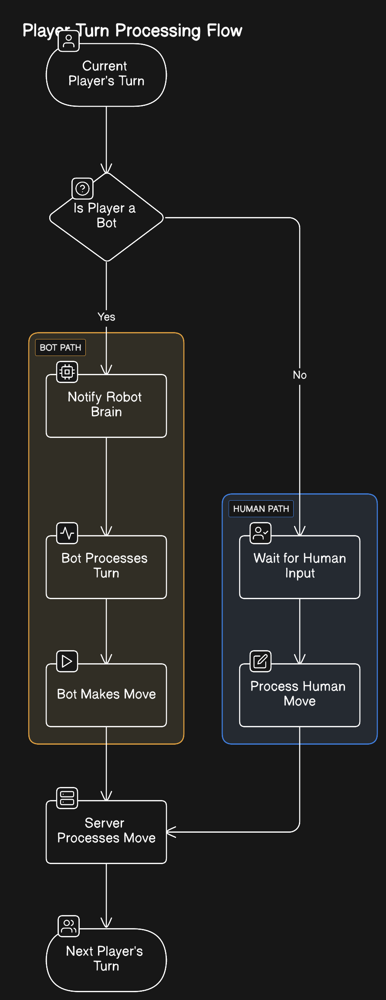

# AI Integration Documentation

## Bot Activation Flow

<div style="text-align: center;">
    
</div>

---

## Current Workflow

### SOCGame
```java
advanceTurnStateAfterPutPiece() {
    // Update game state
    // Move to next player
    // Notify handlers
}
```

### SOCGameHandler
```java
handleGameState() {
    // Check if current player is bot
    if (currentPlayer.isRobot()) {
        // Notify bot brain to take its turn
    }
    // Wait for move (from bot or human)
    // Process move when received
    // Advance to next player
}
```

### SOCRobotBrain
```java
run() {
    // Wait for "your turn" notification
    // Analyze game state
    // Make decision
    // Send move to server
}
```

---

## Future Workflow

### GameStateConverter
```java
// Add a new class: GameStateConverter
class GameStateConverter {
    // Convert local game state to backend format
    public BackendState convertToBackendState(SOCGame gameState) {
        // Convert game state...
        return backendState;
    }

    // Convert backend response to local game state
    public SOCGame convertFromBackendState(BackendState backendState) {
        // Convert backend state...
        return gameState;
    }
}
```

### BackendCommunicator
```java
// Add a new class: BackendCommunicator
class BackendCommunicator {
    private GameStateConverter converter;
    
    public BackendMove getNextMove(SOCGame gameState) {
        // Convert state
        BackendState backendState = converter.convertToBackendState(gameState);
        
        // Send to backend, get response
        BackendResponse response = sendToBackend(backendState);
        
        // Convert response back
        return convertResponseToMove(response);
    }
}
```

### SOCGameHandler
```java
// Modify SOCGameHandler:
class SOCGameHandler {
    private BackendCommunicator backendComm;
    
    handleGameState() {
        // Check if current player is bot
        if (currentPlayer.isRobot()) {
            // Instead of direct bot brain notification,
            // communicate with backend
            BackendMove move = backendComm.getNextMove(currentGameState);
            processMove(move);
        }
        // Process move when received
        // Advance to next player
    }
}
```

### WrapperServer
```java
// New wrapper server class:
class WrapperServer extends SOCServer {
    private BackendCommunicator backendComm;
    private GameStateConverter converter;
    
    @Override
    protected void handleGameAction(GameAction action) {
        // Convert game state if needed
        BackendState state = converter.convertToBackendState(currentGame);
        
        // Sync with backend
        backendComm.syncState(state);
        
        // Then process normally
        super.handleGameAction(action);
    }
}
```